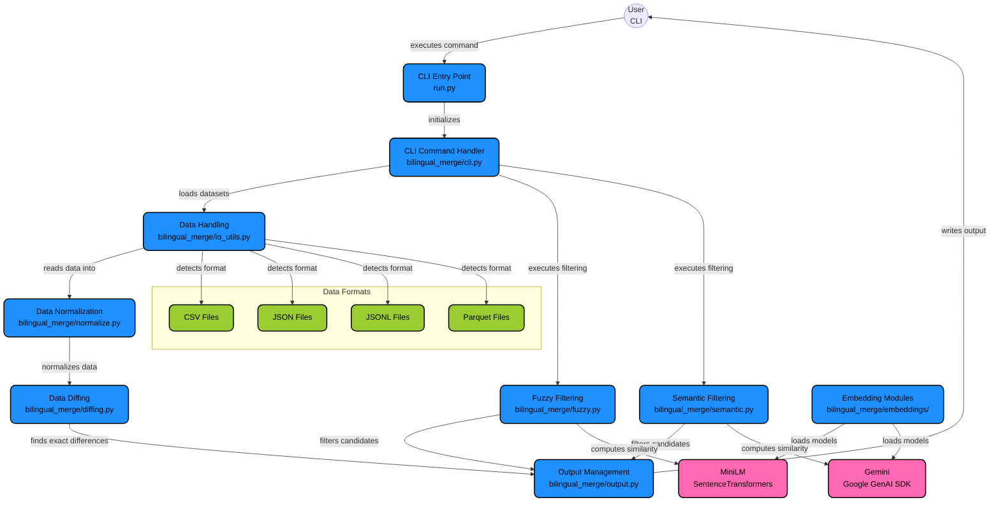

# Bilingual Merge (df-diff)

A tool for intelligently merging bilingual datasets by detecting and filtering unique entries using exact matching, fuzzy matching, and semantic similarity.

## Overview

This tool compares two bilingual datasets (with English and French columns) and merges unique rows from the source into the target dataset. It uses a three-stage filtering process:

1. **Exact matching**: Identifies rows that don't exist in the target
2. **Fuzzy matching**: Filters out rows with high string similarity using RapidFuzz
3. **Semantic matching**: Uses embeddings to detect semantically similar entries

The final output is a deduplicated JSONL file containing the merged dataset.

## Installation

### Base Installation

Install dependencies using `uv`:

```bash
uv sync
```

Then set your API key:

**Linux/macOS:**
```bash
export GEMINI_API_KEY="your-api-key-here"
```

**Windows (PowerShell):**
```powershell
$env:GEMINI_API_KEY="your-api-key-here"
```

**Windows (Command Prompt):**
```cmd
set GEMINI_API_KEY=your-api-key-here
```

## Usage

### Basic Example

```bash
python run.py \
  --source source.parquet \
  --target target.parquet \
  --en-col en \
  --fr-col fr \
  --out merged.jsonl \
  --fuzzy-threshold 92 \
  --semantic-threshold 0.82 \
  --embed-backend minilm
```

### Command Options

| Option | Description | Default |
|--------|-------------|---------|
| `--source` | Source dataset path (parquet/csv/jsonl/json) | *required* |
| `--target` | Target dataset path (parquet/csv/jsonl/json) | *required* |
| `--out` | Output JSONL file path | *required* |
| `--en-col` | Name of the English column | `en` |
| `--fr-col` | Name of the French column | `fr` |
| `--fuzzy-threshold` | Keep rows whose best fuzzy match score is below this (0-100) | `92` |
| `--semantic-threshold` | Keep rows whose best cosine similarity is below this (0-1) | `0.82` |
| `--embed-backend` | Embedding backend: `minilm` or `gemini` | `minilm` |
| `--minilm-model` | MiniLM model identifier | `sentence-transformers/all-MiniLM-L6-v2` |
| `--gemini-model` | Gemini embedding model identifier | `gemini-embedding-001` |
| `--gemini-api-key` | Gemini API key (optional if `GEMINI_API_KEY` env var is set) | `None` |
| `--max-candidates-per-row` | Maximum target rows to scan per candidate (speed cap) | `200` |

### Supported File Formats

The tool supports the following input formats:
- Parquet (`.parquet`)
- CSV (`.csv`)
- JSONL (`.jsonl`)
- JSON (`.json`)

Output is always JSONL format.

## How It Works

The tool follows a multi-stage filtering pipeline to ensure only truly unique entries are merged:

1. **Read & Normalize**: Both datasets are loaded and normalized to ensure consistent column names (`en` and `fr`)
2. **Exact Diff**: Rows present in source but not in target are identified using an anti-join operation
3. **Fuzzy Filter**: Candidates are filtered using string similarity (RapidFuzz) - rows with similarity scores above the threshold are removed
4. **Semantic Filter**: Remaining candidates are filtered using embeddings (MiniLM or Gemini) - rows with cosine similarity above the threshold are removed
5. **Merge & Dedupe**: Unique rows are appended to target and deduplicated to ensure no duplicates exist
6. **Output**: Final merged dataset is written as JSONL format

The tool provides progress summaries at each stage showing how many rows remain after each filtering step, helping you understand the filtering effectiveness.

## Architecture

The following diagram illustrates the system architecture and data flow:



## Examples

### Using MiniLM (Local Embeddings)

```bash
python run.py \
  --source data/source.csv \
  --target data/target.csv \
  --out results/merged.jsonl \
  --embed-backend minilm \
  --fuzzy-threshold 90 \
  --semantic-threshold 0.85
```

### Using Gemini (API-based Embeddings)

```bash
python run.py \
  --source data/source.parquet \
  --target data/target.parquet \
  --out results/merged.jsonl \
  --embed-backend gemini \
  --gemini-api-key "your-key-here" \
  --fuzzy-threshold 95 \
  --semantic-threshold 0.80
```

## Requirements

- Python >= 3.13
- See `pyproject.toml` for full dependency list

### Key Dependencies

- **polars**: Fast DataFrame operations
- **rapidfuzz**: Fast string similarity matching
- **sentence-transformers**: For MiniLM embeddings (local)
- **google-genai**: For Gemini embeddings (API-based)
- **typer**: CLI framework
- **rich**: Beautiful terminal output

## Project Structure

```
df-diff/
├── bilingual_merge/
│   ├── cli.py              # Command-line interface
│   ├── main.py             # Main entry point
│   ├── config.py           # Configuration dataclass
│   ├── normalize.py        # Data normalization
│   ├── diffing.py          # Exact difference detection
│   ├── fuzzy.py            # Fuzzy matching logic
│   ├── semantic.py         # Semantic similarity filtering
│   ├── io_utils.py         # File I/O utilities
│   ├── output.py           # Output formatting
│   └── embeddings/         # Embedding backends
│       ├── base.py         # Base embedder interface
│       ├── minilm.py       # MiniLM implementation
│       └── gemini.py       # Gemini implementation
├── run.py                  # Entry point script
├── pyproject.toml          # Project configuration
└── README.md               # This file
```

## Notes

- The tool uses **cosine similarity** for semantic matching (embeddings are normalized)
- Fuzzy matching uses **RapidFuzz** with default scoring algorithm
- **Only the English column is used for similarity matching** (both fuzzy and semantic). The French column is preserved in the output but not used for comparison.
- The `--max-candidates-per-row` parameter limits the number of target rows scanned per candidate to improve performance on large datasets
